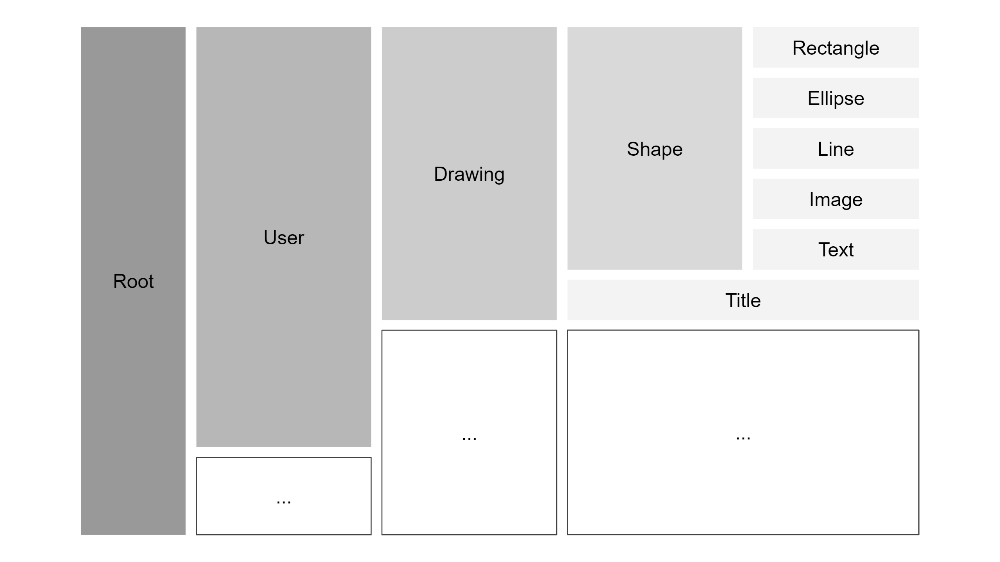

# Drawing Editor

Use our editor to create drawings with search-to-add images(and GIFs and stickers), texts, and simple shapes.


# Tech stack

React.js and Firebase/Firestore.
Unsplash and GIPHY APIs are used for image searching.

# Data Schema

NoSQL stores like firestore are a strong fit our use case. It provides scalability since as data can grow exponentially. Here we are using a data schema that best utilizes this scalability while preserving some flexibility.



As seen above, the root level contains a collection of user documents, which then contains a collection of drawing documents, which then contains a collection of shapes and one extra field.

# To run the app, create configuration files

This app needs 2 configuration files to run:
First is `config.js`, to be put under the path `src/firestore/config.js`. Fill the template below with information from your firebase console.
```
exports.firebaseConfig = {
  apiKey: "...",
  authDomain: "...",
  databaseURL: "...",
  projectId: "...",
  storageBucket: "...",
  messagingSenderId: "...",
  appId: "..."
};
```
Second is `APIconfig.js`, to be put under the path `src/containers/ControlPanel/AddImageDialog/APIconfig.js`. Fill the template below with API keys from your Unsplash and GIPHY developer accounts.
```
exports.APIConfig = {
  GIPHY_API_KEY: "...",
  UNSPLASH_API_KEY: "..."
}
```

# Credit

This is a project based on [homework 5 for the course 05-431](https://www.cs.cmu.edu/~bam/uicourse/05631fall2020/HW5/index.html) in Carnegie Mellon. We used the starter template for the homework as the basis for the project.